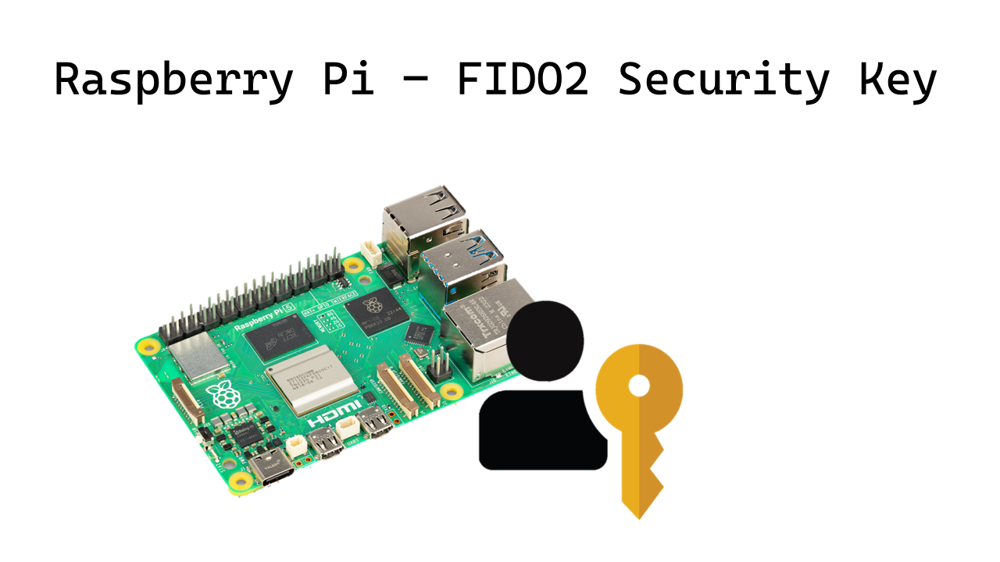

# Raspberry Pi FIDO2 Key

## With support for Post Quantum Cryptography now

This is FIPS-204 compliant. With specifications from the proposed/requested specs by IETF

## This project converts an RPi 5 or RPi Zero/ Zero 2 W to a FIDO2 Security Key



### ⚠️ DO NOT USE THIS IN PRODUCTION, THE CRYPTOGRAPHIC KEYS ARE STORED IN CLEARTEXT

## ⚠️ This does not yet implement Pin/ Biometric verification 

For visual outputs, connect an LED to `GPIO 16`.

A push button or touch sensor should be connected across `GPIO 26` and `GND` for the UP verification.

Install Raspberry Pi OS Lite on the Raspberry Pi. (Lite is preferred for faster boot time).

You should be able to access the RPi Terminal with a keyboard + screen or via SSH.

## Installation steps:

1. Install Git
```
sudo apt-get update
sudo apt-get install git
```

2. Get this repository URL
    
    Click on the Green `<> Code` button on this page and copy the URL

3. Clone this repository
```
git clone <Repository URL>
```

```
git clone https://github.com/AdityaMitra5102/RPi-FIDO2-PQC-Security-Key.git
```

4. Go into the folder

    Use `cd` to go into the folder you just cloned

   ```
   cd RPi-FIDO2-Security-Key
   ```

6. Make the installer executable
```
sudo chmod +x installer.sh
```

6. Run the installer as root
```
sudo ./installer.sh
```
7. Wait till the system reboots.

The RPi will now behave like a security key. Connect the RPi to the PC via the USB C port.

## Power consideration with RPi 5

The device ideally draws around 4w (5v, 800 mA). Normal laptops or phones (without Thunderbolt) may not be able to provide this amount. Hence, it is recommended to power the device via GPIO pins or POE if you notice the device being unable to boot up or frequently shutting down.

## Demo RP Server
https://github.com/AdityaMitra5102/python-fido2-PQC (Forked from Yubico/python-fido2)

## Video Demo
https://youtu.be/qAKDtAn4LVg?si=P9v7KEMAkNYpWoLS


